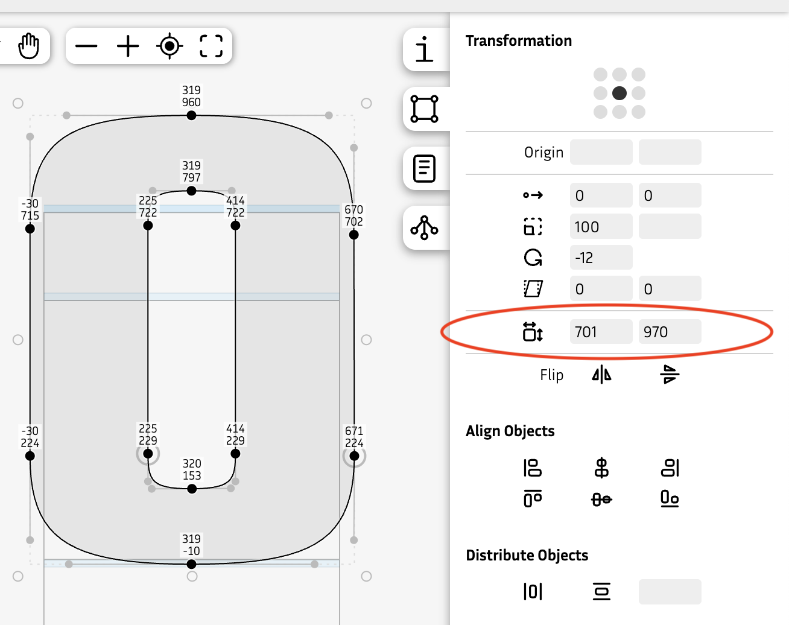

Hello, and welcome to a new Fontra blog post! It's been a while.

### Looking back at 2025

The past year has been quite eventful. Black Foundry has been slowly dissolved, and funding for Fontra has had ups and downs. We managed to introduce a bunch of powerful new features, such as a font overview, a sidebearing tool and a kerning tool, to name just a few.

We heard more and more stories from educators who successfully used Fontra in their classes and workshops. Fontra being free and cross-platform have been important factors here.

In August, Fontra left the Google Fonts umbrella and we created an [independent GitHub organization](https://github.com/fontra/), where all the source code repositories are now hosted.

We low-key feel that Fontra reached "1.0" during 2025, and in November we started issuing releases for [Fontra Pak](https://github.com/fontra/fontra-pak/releases), instead of only providing nightly builds.

Linux support improved quite a bit thanks to initiatives from the community, especially from Anirban Mitra. In addition to a binary download for Linux, we now have support for the `flatpak` distribution system.

Doing proper releases also allows us to be present in the `homebrew` distribution system for macOS.

Looking back, despite some ups and downs, 2025 has been a great year for Fontra.

### Recent developments

The font overview was significantly improved:

- You can now select a range of glyphs by click-dragging over the cells. The shift key and the command/meta key can be used to refine the selection.
- It is now possible to copy/paste and delete (multiple) glyphs. With undo/redo.

_Selecting multiple glyphs and deleting them:_

<video src="delete-multiple-glyphs.mp4" controls="controls" loop muted></video>

_Copying and pasting a range of glyphs:_

<video src="copy-paste-multiple-glyphs.mp4" controls="controls" loop muted></video>

_Copying a single glyph and pasting it into a range of glyphs:_

<video src="paste-single-into-multiple.mp4" controls="controls" loop muted></video>

#### Responding to external changes

An important goal for Fontra is to be able to work side-by-side with other font editors. For example, Fontra is usable as a secondary viewer while working in a different application. So it needs to respond to changes on disk made by those other applications. This worked reasonable well for glyph changes in `.ufo` files and changes in `.designspace` files.

This automatic reload functionality has recently been greatly improved for the `.ufo` format: Fontra now responds to external changes in kerning, groups, features and font info.

But, even more excitingly, we added automatic reload support for the following formats:

- `.glyphs` and `.glyphspackage`
- `.fontra`
- `.ttf`, `.otf`, `.woff`, `.woff2` and `.ttx`

Read-only support for the `.ttx` format was recently added.

### Less recent developments

There is a new sidebearing tool with which you can edit sidebearings interactively:

<video src="sidebearing-tool.mp4" controls="controls" loop muted></video>

As well as a new kerning tool:

<video src="kerning-tool.mp4" controls="controls" loop muted></video>

The transformation panel got a new set editable dimensions fields, where you can see but also edit the width and height of the current selection:

### Looking forward to 2026

2026 is looking very good so far: we've secured some more funding and there are some exciting new features planned.

The next big project to work on will be live OpenType feature previewing, with proper text shaping and right-to-left support. This will involve the fantastic HarfBuzz library. 

Another big thing will be support for scripting and plugins, so people can write their own tools that integrate with Fontra.

The user documentation has been neglected a bit, and we will work to get that back on track.

In April, the [Fontstand conference](https://fontstand.com/conference/2026) will host a Fontra workshop led by Just van Rossum.

Please keep in touch with us via the usual channels:
- [Mastodon](https://typo.social/@fontra)
- [Discord](https://discord.gg/SeZWugEYzd)
- [GitHub](https://github.com/fontra)
- [Instagram](https://www.instagram.com/fontra_editor)
