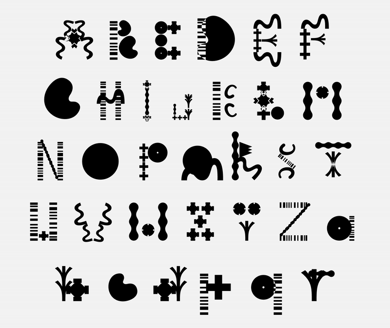

This month, Jérémie, Gaëtan and Just took a trip to Nancy (France), to participate in the [Automatic Type Design symposium](https://automatic-type-design.anrt-nancy.fr/colloques/automatic-type-design-3) organized by [ANRT](https://anrt-nancy.fr/en).

We led two one-day Fontra workshops, each with about 20 participants, using our internal collaborative Fontra server. The participants were a mix of international students and professionals, with very diverse backgrounds. They got to learn the basics of creating variable fonts with Fontra, while working collaborative in small groups. We especially encouraged them to use variable components.

_Some experimental letterforms created in Fontra, by a group of workshop participants:_

The following two days were packed with very inspriring talks. Several talks focussed on algorithmic type design, and/or experimental approaches to drawing digital letters.

The last day of the symposium was dedicated to a series of demos. We got to do a compact Fontra demo, where we talked about the ideas behind Fontra, and showcased the core set of features. We were happy to answer some good questions from the audience.

https://www.youtube.com/watch?v=yiupIidTw4I

### Updates

We added initial support for global guidelines. Previously, Fontra only supported per-glyph guidelines. If set up consistently, global guidelines can interpolate across the font's designspace, just like glyph-level guidelines.

The font sources panel got a redesign: the old design was too hard to extend. This was partially motivated by the new global guidelines feature.

In addition to .ttf and .otf, Fontra can now read the .woff and .woff2 formats, for convenient inspection of such font files, or for conversion to an editable format.

Many smaller bugs and user-experience issues were fixed. For a complete list, please have a look at the [list of recent changes](https://fontra.xyz/changelog.html).

### Work In Progress

There was a lot of development in several work-in-progress features.

We are working on making Fontra able to edit .glyphs and .glyphpackage files. This is a multi-stage project, where we initially focus on editing glyph-level data: outlines and (variable/smart) components. This work is nearly completed, and we expect it to land next week.

Background layers (or _scratch/sketch_ layers) is a much-requested feature, which is developing nicely, and is expected to land soon, too.

Work is being done to expose more advanced font info data, such as various lower level line metrics data and other font-level info, so users can control these fields when exporting to .ttf or .otf. This set of features was also an important motivation for the redesign of the font sources panel.

As mentioned last month, Simon Cozens is working on changes to the front-end code to make a server-less version of Fontra possible. It includes setting up a _bundler_ (webpack in our case), and makes a much clearer separation between our server code and the front-end code and assets. This work is nearing completion and will be merged very soon. It is a tricky operation as it moves and touches a _lot_ of files, and this can get in the way of other work-in-progress if we're not careful.
