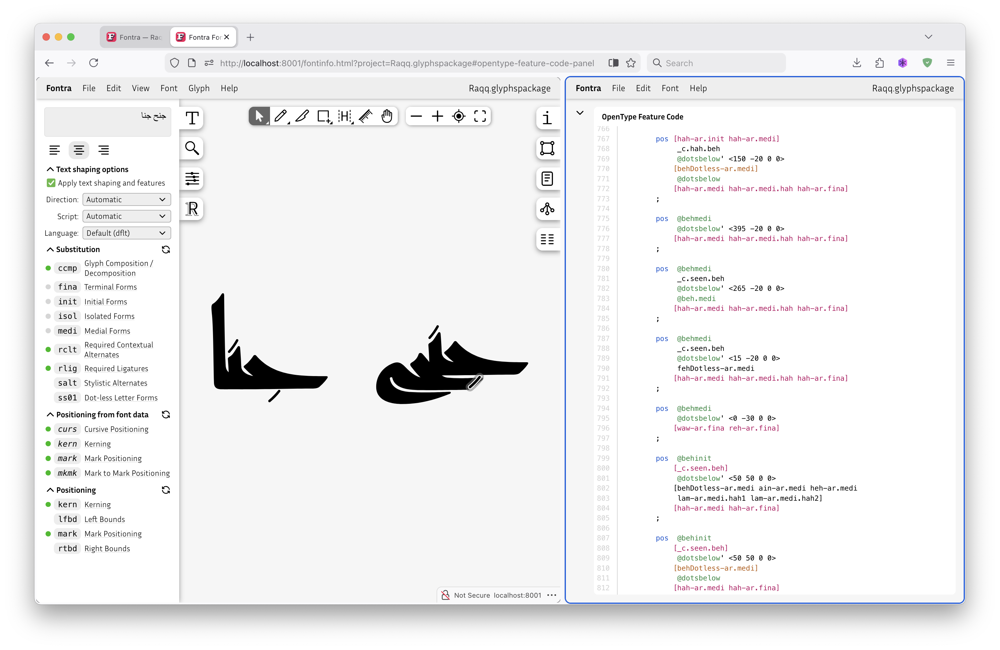
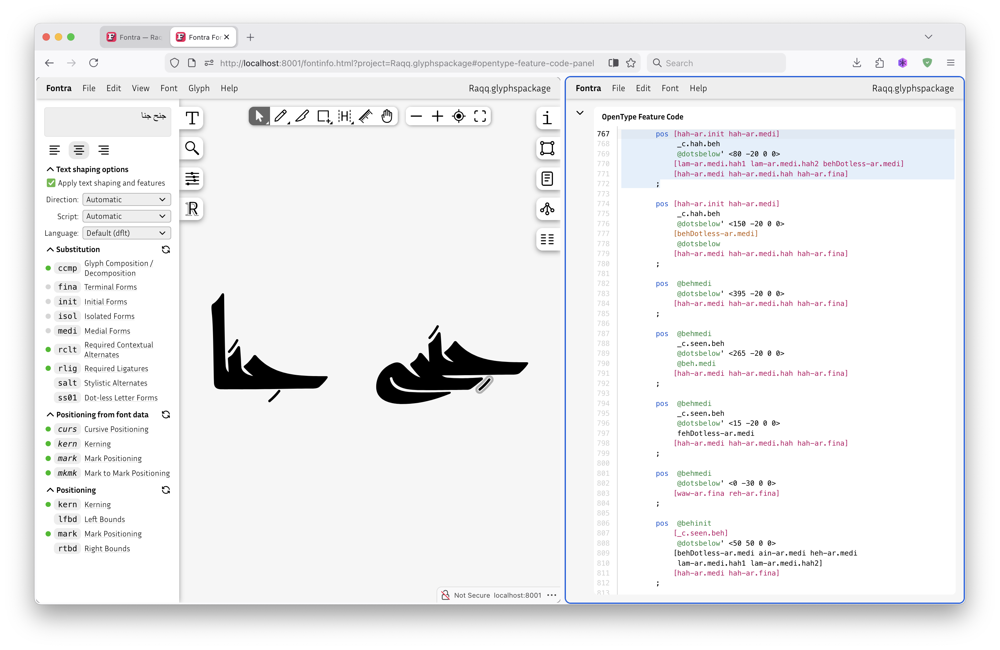

*This is a guest blog post by Khaled Hosny, adapted from [a post on Mastodon](https://typo.social/@khaled/116188327472519982)*

The previous [blog post](https://blog.fontra.xyz/blog/opentype-harfbuzz/) about Text shaping and OpenType features is a very interesting write-up, and I suggest everyone interested in font making to read it.

The technical part at the end is the most interesting to me. I’m particularly proud of the very neat trick that allows Fontra to emulate glyph positioning while maintaining interaction between it and manually written feature code.

### Generated features vs. emulation

For context, font editors will generate positioning features from kerning and anchor data in the font.

Sometimes one wants to add some other feature code before or after the generated one. For example, in Arabic fonts dots can be handled as separate mark glyphs that are positioned using regular anchors, and sometimes the dots clash with neighboring glyphs, and to fix that we may contextually move the dots around to fix the clash (instead of resorting to less desired solutions like changing the spacing of the base glyphs). One way to achieve that, is by writing contextual glyph positioning rules that applies these movements.

The contextual rules have to be applied after the generated mark positioning rules, since mark positioning is not cumulative (unlike kerning), and if it got applied after the contextual positioning lookup, it will override it.

Here, the default position of the dot (the rectangular stroke) of the _jeem_ clashes with the _hah_ underneath. We could have moved the dot further right by default, but this would have made it off center in situations where there is no clash, which is not desired:

The more desired solution is to contextually move the dot to the right (and slightly down, to align with the _hah_):

To control the order of the lookup between the generated code and the manually written one, we use a special comment (as explained in the blog post).

However, Fontra does not generate positioning feature code during live preview, as it does the glyph positioning itself, while the rest of the shaping is done by HarfBuzz (as also explained in the blog post).

### Making HarfBuzz call Fontra

So how would it do this emulation in the middle of lookup application by HarfBuzz?

HarfBuzz has a so-called “message” callback that allows the caller to get a message about what HarfBuzz is doing and the HarfBuzz glyph buffer before and after each shaping step (this is what [Crowbar](https://www.corvelsoftware.co.uk/crowbar/) uses to show OpenType layout processing step by step).

Here comes the neat trick: Fontra registers a message callback function, which HarfBuzz calls before and after each lookup is applied, and whenever HarfBuzz is about to apply a lookup that the generated code would have been inserted before, Fontra steps in and modifies the glyph buffer to apply its own positioning logic. So it is af if Fontra is creating and applying lookups on the fly, while not actually creating any. 

Then HarfBuzz will proceed to apply later lookups, which will modify the glyph positions (if applicable) as it would have happened with a fully compiled font.

Okay, this is a super nerdy topic and maybe very few people get why I’m so excited about it, but I’m really proud of it.

*— Khaled Hosny*
