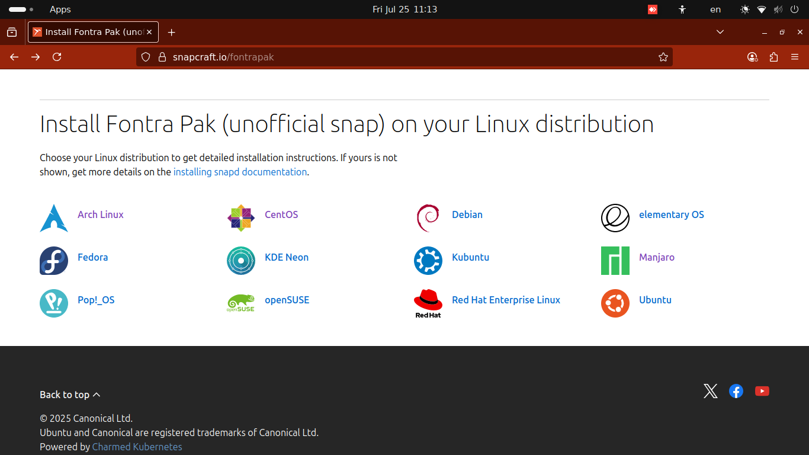
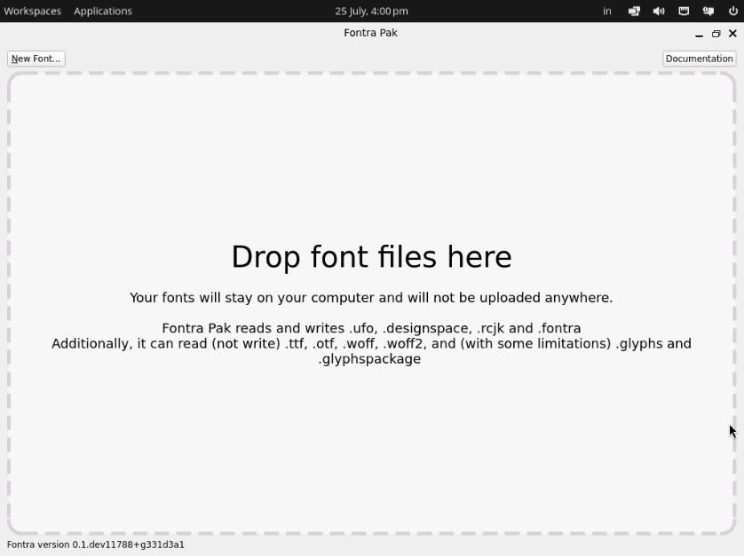

This is an invited guest blog post by [Dr. Anirban Mitra](https://github.com/mitradranirban).

# Fontra Font Editor on GNU/Linux Desktop

Fontra is a free/libre open source cross-platform browser-based variable-first font editor.

Though MacOS and Windows compatible binaries are available from [official website](https://fontra.xyz), Linux Desktop users can also use Fontra to create or modify their font. As is common with the Linux ecosystem, there are multiple ways to do it.

## Compiling from source

Experienced Linux users who are comfortable with downloading the source and compiling at their local machine, can do so by cloning the [Fontra github repo](https://github.com/fontra/fontra) and following the instructions in [README.md](https://github.com/fontra/fontra/blob/main/README.md). Remember if you want to create a new font project, or export the font from fontra itself you should clone and compile [Fontra Pak](https://github.com/fontra/fontra-pak).

The steps involve running the following commands in a terminal:
```
git clone https://github.com/fontra/fontra-pak
cd fontra-pak/
. venv/bin/activate
pip install -r requirements.txt
pyinstaller FontraPak.spec -y
```
The compiled binary will be available under fontra-pak/dist directory.

The benefits of compiling from source include:

* Getting a software which is custom made for your hardware.
* It is currently the only option for Linux users running on non X86_64 platforms like ARM or PPCs based and older unsupported versions of Linux.
* It is also the way officially supported by the developers in Linux.

However new and casual users of Linux need not compile from source. They can easily install using any of the following options.

## Pre-compiled Binary

A pre-compiled binary created in a ubuntu-22.04 runner in GitHub is [available for download here](https://github.com/mitradranirban/fontra-pak-linux/releases). This can be used in any Linux distribution with glibc version 2.35 or newer and AMD64 architechture. You can download the fontrapak.tgz file, just untar the package, make it executable and run it.
```
tar -xvf fontrapak.tgz
cd fontrapak/
chmod +x fontrapak
./fontrapak
```

In case the pre-compiled binary does not work in your system, or you want to sandbox the application, or want to launch by just clicking an icon, you have option for going for either snap package or flatpak wrapper of Fontra Pak.

## FontraPak Snap package

Ubuntu users can install Fontra Pak directly from 'Ubuntu Software' by searching for `fontrapak`.


For other supported Linux distributions you have to basically enable `snapd` in your distribution and then run the command

`sudo snap install fontrapak`

For instructions for enabling `snapd` in you Linux distribution go to [Fontra Pak snapcraft page](https://snapcraft.io/fontrapak) and click on your distribution on the bottom of the page.



If you want latest nightly build of Fontra Pak instead of manually tested slightly older **stable** version, install from the **edge** channel 

`snap install fontrapak --channel=edge`

After installation, search for `fontrapak` and click on the `fontrapak` launcher


or simply type in a terminal

`fontrapak`

### Response to fontrapak snap

Since its release in April 2025, Fontra pak unofficial snap is showing good growth in its users across various countries even in non Ubuntu Linux distributions.


However many Linux users express their unwillingness in using snaps, reasons being

* Snap is disabled or cumbersome to set up in some distribution.
* They are not ok with propietory store backend and tracking associated with snap packages.
* They don't like the mandatory update feature of snap packages.
* Installing snap package requires *sudo* previlege, all user may not have that.
* Big memory footprint of mounted snaps even when not in use. 

All those factors were limiting use of Fontra snap in desktop Linux.

## Fontrapak Flatpak

So a flatpak wrapper is made around the same pyinstaller binary and is available for download from [this github project](https://github.com/mitradranirban/fontrapak-flatpak/releases).

* To install, open a terminal and change to the directory where you downloaded the flatpak

`cd path/to/downloaded/fontra-pak.flatpak` 

* To download dependancies enable flathub repository

`flatpak remote-add --if-not-exists flathub https://dl.flathub.org/repo/flathub.flatpakrepo`

* Install the fontra-pak flatpak, either system wise or for the current user only
```
flatpak install fontra-pak.flatpak
```
* Now search for FontraPak in Applications and click on the Fontra icon. 


## Using Fontra Pak in Linux

All the above method will open the Fontra Pak window.



After that the user can:

* Click on the Documentation Button to read the documentation
* Click on the New Font... Button to create a new font
* Drag or drop any of the supported format of file from your file manager on to the Fontrapak window.

A local browser window will open and fonts can be viewed or edited (in case of writable formats) in the browser window. A font can be generated from the browser interface.

Remember, due to sandboxing nature of snap apps, it can accesss files only in the user's home directory.

### Updating Fontra in Linux

Snap packages are automatically updated. If it is not, you can update with the command
`sudo snap refresh fontrapak`

To update pre-compiled pyinstaller binary or Flatpak just visit the repository form where you downloaded and download and install the latest version.

## Some backstory, and how I got involved

I am a physician by training and profession, I took up making fonts as a hobby as part of [an initiative to enable Bengali in Linux](https://opensource.com/article/20/7/linux-bengali). For more than 20 years, I have been using fontforge as my only font editor, and being an amateur, it was sufficient for my font making. About a year ago, in July 2024, I came across a youtube video about making a variable font using fontforge. I got interested in variable font technology and started making a very simple [variable font with rectancular components](https://github.com/mitradranirban/samaano-fonts) using Fontforge. However it was very difficult to use a tool for a job it was not meant to be. So I frequently faced difficulties. Using a commercial font editor was out of question as it is a hobby project and I needed something that would work in my Ubuntu workstation as I have stopped using Windows since 2017.

Then I came to know about Fontra. I cloned the repository and started using Fontra. It was a refreshing user interface compared to age old UI of Fontforge. My novice-level questions were quickly answered by Just van Rossum. But though I was using Fontra to edit the glyph, I was using fontmake to compile the font. Problem arose when I made a font with variable component which fontmake failed to compile. Just suggested that I can use Fontra Pak to export the font which will take care of the variable components. So I compiled FontraPak and started using it.

### Snapping the Pak

In an [conversation in mastodon about Fontra](https://typo.social/@fontra/114262871554026245), Just suggested if community contributes to making Linux app, he would gladly incorporate it, as he can not test in Linux himself. I read about snap packaging, searched the snapcraft forum , and tried my hand in making the snap.

#### Trials and Tribulations

My lack of a programming background was a big hindrance to create an effective solution. I also found there are few knowlegable volunteers left in the forum who could guide me in the process. So I look help of Large Language Model (LLM) chatbots. But LLMs often produced outdated or plain wrong code. Coding with them seemed to me like a blind showing the road to another. Moreover due to network congestion and instability in our area, I had difficulty in building locally, so used ubuntu launchpad and github bulder. I also undertook a strategy of debugging the code of one LLM with another, as though they could not find fault in their own code, they seemed expert in picking up fault in code generated by another LLM. And by feeding the build error code helped in gradually correcting the packaging errors. Finally the snap was published in snap store on 4th of April.

Despite not using Linux themselves, Fontra develeopers, particularly Just van Rossum, always encouraged my endevour, so I was able to automate the snap generation by Github actions. Now nightly build was automatically packed in the edge channel of snap store.

### Flattening the Pak

I got feedback from some users that snap "is not just the right thing" for a free software. As indicated above, a flatpak would be a better solution. I wanted to build the Fontra flatpak from source buteven with the help of LLMs like Github Copilot could not correct the errors, and finally I gave up. So I took the same shortcut as that of the snap package of creating a flatplak wrapper around the pyinstaller binary, that will provide the necessary dependancy, also providing a simple way to install and launch the app in Linux desktop.

### Future of Fontra in Linux

I found out pyinstaller compilation is unnecessary in Linux. If all the requirements are install in a python virtual environment in downloaded fontra-pak directory, the FontraPakMain.py script can be directly run from the venv and it has a smaller memory footprint.


 I tried this approach for both snap packaging and Flatpak initially but failed, either due to my inexperience or may be due to the sandbox environment in which snap and flatpak are generated. 

But it may be possible by an experienced python app packager to package Fontra Pak as a native app like `.deb` package (for Debian/Ubuntu/Mint etc) or a `.rpm` package (for Fedora/RHEL/Suse). It will also make it installble in Linux in non X86_64 architecture (Fontra in Raspberry Pi, anyone?).

In future I expect Fontra to be in repository of all major Linux distributions. Any help in this regard will be highly solicited by both Fontra developers as well as Desktop Linux users who will get easy accesss to next generation of Free and Libre Font editor.
