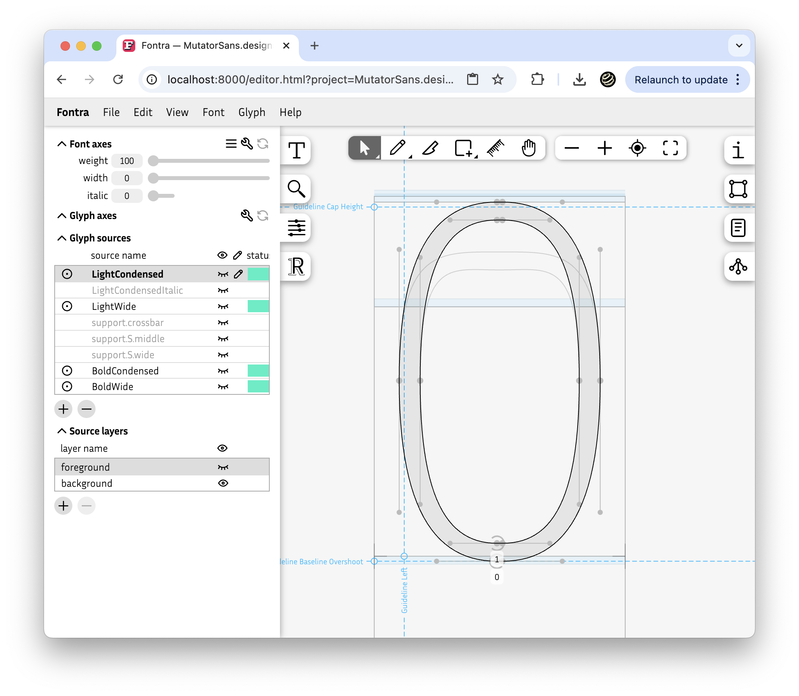
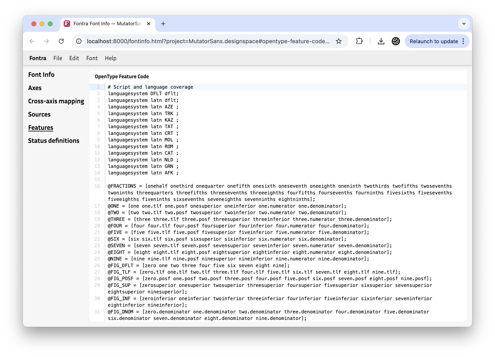

We welcomed a sizable set of new features and improvements this month:
- Global source locations
- Background layers
- OpenType settings UI
- OpenType feature editor
- Glyphs backend changes for writing
- Improved backend/frontend separation

### Global source locations

This set of features has been in the works for a very long time (at least a year), and deserves a bit more explanation.

Fontra allows glyphs to have as many or few sources at different locations within the design space. This is not limited or enforced by global settings, apart from the definition of variation axes. Until now, this information belonged solely to the glyph. While this is flexible for the glyph, this becomes problematic if global aspects of the design space change after glyphs have been constructed. For example, when the range of an axis needs changing.

We have had the concept of “font sources” for a while. A “font source” has a location in the designspace, and is used as a place to hold information specific to that location. This is where vertical metrics (cap height, x-height, ascender, descender) are managed, global guidelines, and more. So these locations are considered important within the project.

Commonly, one wants to draw glyph sources as well at (some of) these locations. We have introduced the concept of a “location base”, with which a *glyph source* can reference a *global font source*. A glyph source that uses this does not define its own location in design space, but refers to a global font source. This means that we can now change the location of all glyphs that reference a specific font source by editing the referenced font source.

Additionally, this gave us the opportunity to improve the user experience when drawing variable glyphs. Previously, for each glyph, each desired source had to be created explicity. For example, if you wanted to draw a Bold variant for a glyph, the user would have to navigate to the desired Bold location, and then create the Bold source with a button click and a dialog confirmation before they could make the Bold outline. Now you can do it with a single click.

We have improved the UI for the glyph sources list in a couple of ways:

* Global locations for which the glyph does not yet have a source is shown in the list, rendered in gray so the user sees “this location does not yet have a drawing”.
* After selecting such a source, the user can immediately manipulate the outline for that location. This implicitly creates the glyph source, and saves a lot of clicks when designing a variable glyph.  
* A new source always starts with an interpolation. For example, if Regular and Bold sources already exist, but not yet a Medium source, going to the Medium source (provided it is defined as a font source) allows the user to instantly refine the shape at the Medium location.

Summarizing, this new feature brings two great improvements:
* After setting up the global sources, it becomes much much easier to populate the sources for variable glyphs.
* The locations for glyph sources *that use the location base feature* can be edited globally. _(Note that it is still possible to create sources that store their location strictly locally)_

### Background layers, aka. “Source layers”

Fontra finally has a background layers feature. This took a fair amount of effort to implement, and this checks off a much-requested and needed feature from our list. Users can now create arbitrary additional layers to paste variations or sketch work or reference shapes.

In addition to “background layers” we also call them “source layers”, as each background layer belongs to a glyph source. Reminder: a glyph source specifies a location in the design space.

The screenshot in the previous section also shows the new “Source layers” list.

[Documentation about source layers](https://docs.fontra.xyz/reference/editor-view/panels/designspace)

### OpenType settings UI

The Font info panel and the font sources panel have been enhanced with UI to add specific lower level OpenType-related settings data, so that users can tune details of the output of binary font files. Examples include settings for the `hhea`, `vhea`, and `OS/2` tables.

### OpenType feature editor

We added a new panel in the Font info view to edit OpenType feature source code. We integrated a powerful open source code editor component called [CodeMirror](https://codemirror.net/). In the future, this can be enhanced with more refined code completion and syntax highlighting.

### Glyphs backend changes for writing

Our backend for reading `.glyphs` and `.glyphpackage` files has been upgraded to also *write*. This is a work in progress that is being rolled out in phases. We have completed the first major step, which adds editing and creation of basic glyph data, including editing and creating of background layers. We cannot yet create a .glyphs file from scratch, but we find this a very exciting start.

So, to emphasize and repeat, *you can now open your `.glyphs` and `.glyphpackage` files directly in Fontra Pak and start editing glyphs and start creating new glyphs!*

### Improved backend/frontend separation, aka. the “JS-split” Big-Bang operation

Simon Cozens proposed and then implemented a major refactoring in how our server code and front end code is organized, and improved the documentation for how they interoperate. The initial purpose of this is to allow him to experiment with a server-less version of Fontra. Additionally, it improved the code base generally by modernizing the project to use a bundler for JavaScript (and other language) resources. It did make our build somewhat more complex, especially with out-of-tree front end extensions such as fontra-rcjk. We managed to keep breakage to a minimum, but as expected we did experience some fallout in the form of minor regressions, that have since been fixed.

### Menu bar improvements

We received excellent contributions from Johannes Abendroth, who (among other things) vastly improved the menu bar and menu panel’s keyboard navigation functionality.

### Documentation

There have been many content updates to our [user documentation website](https://docs.fontra.xyz/).

We would love to receive suggestions, additions and improvements from the community, and encourage anyone (you?) to participate in [the documentation repository](https://github.com/googlefonts/fontra-docs). Documentation is hard, and we need your help.

### Next up

The biggest and highest priority item on our TODO list is currently to add functionality to author and edit kerning. You can imagine that’s going to be a fairly big one. We plan to land it in April, though. This is the last significant step before we will call Fontra "1.0".

### Concluding

March was a very productive month, where we met almost all of our goals. As always, please check the [changelog](https://fontra.xyz/changelog.html) for a more detailed list of changes.

Be sure to check out Fontra’s progress by downloading a fresh version of [Fontra Pak for macOS](https://fontra-download.black-foundry.com/FontraPak.dmg) or [Fontra Pak for Windows](https://fontra-download.black-foundry.com/FontraPak.zip), or check out the [source code for Fontra Pak](https://github.com/googlefonts/fontra-pak) if you’d like to run it on other platforms.
