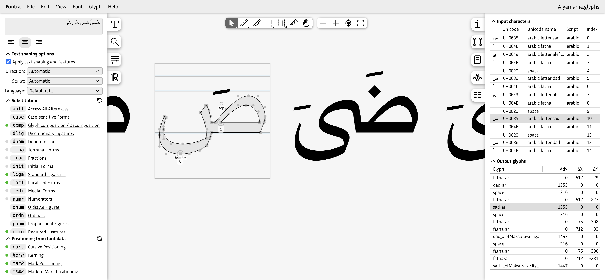

## Introduction

I may be slightly biased, but I think this news is pretty huge: Fontra can finally do proper [text shaping](https://en.wikipedia.org/wiki/Text_shaping) and show OpenType features! This includes support for right-to-left scripts.

OpenType features are nice and useful for simple scripts such as Latin, and can add important typographic refinements (for example kerning or small caps) but in many cases, text still “works” if OpenType features are not available. Not so for [non-simple scripts](https://en.wikipedia.org/wiki/Complex_text_layout) like Arabic and Devanagari, where text shaping and OpenType features are absolutely required for text to become readable at all.

So yes, for Fontra to add text shaping capabilities is a rather big deal.

Before I go into what this practically means, I want to give a huge shoutout to [HarfBuzz](https://en.wikipedia.org/wiki/HarfBuzz), the popular open source library that implements the non-trivial steps to go from Unicode text to a sequence of glyph shapes and their positions, ready for visual rendering. Without HarfBuzz, none of Fontra's new functionality would be possible.

Several aspects of the new functionality are loosely modeled after [FontGoggles](https://fontgoggles.org/), my macOS-only OpenType previewer application.

## Viewing text

How OpenType features are treated depends on what kind of font we are looking at. Fontra distinguishes between two categories of font files:

1. Binary files: `.ttf`, `.otf`, `.woff` or `.woff2`. Additionally, `.ttx` falls in this category, despite it not strictly being binary.
2. Source files: `.designspace`, `.ufo`, `.glyphs`, `.glyphspackage` or `.fontra`.

For binary files, Fontra will use the actual OpenType layout tables in the font (mainly `GSUB`, `GPOS` and `GDEF`). Thanks to HarfBuzz, Fontra's text rendering will match real-world usage of the font.

For source files, Fontra looks at the feature code in the font, as well as kerning data and glyph anchors. With some caveats, Fontra will render text the same *as if the font were an actual TrueType or OpenType font*. I'll write about how this is achieved below.

> #### Using Fontra as an external viewer
>
> For any of the supported file types, Fontra can be used as a secondary viewer:
>
> - Use Fontra as a secondary viewer next to for example Glyphs or RoboFont. Save the font in the other application, and Fontra will automatically update its views.
> - Use Fontra as a viewer for freshly generated OpenType or TrueType fonts. If the file gets regenerated, Fontra will automatically update its views.
>
> Note that Fontra can have multiple windows or tabs open for the same font. You can manually duplicate a view by copying the URL, and pasting into a new browser tab.

## The Text Entry panel

In Fontra's editor view, the user can change the displayed text using the Text Entry panel. This used to be a rather sparsely populated sidebar panel with just a text entry field, a visual alignment control, and a checkbox to toggle kerning on or off.

In the new version, the kerning checkbox has been replaced with several new Accordion sections that allow the user to control details about text layout. It starts with a checkbox named “Apply text shaping and features”. This is on by default, and tells Fontra to use HarfBuzz for text shaping and features. Turning this checkbox off will disable HarfBuzz.



The text entry field automatically detects whether the entered text is right-to-left or left-to-right.

The rest of the controls in this panel offer overrides for writing direction, script and language, as well as feature toggles for individual substitution and positioning features.

### Feature toggles

There are up two three sections of feature toggles.

1. **Substitution:** This section shows toggles for glyph substitution (GSUB) features. It only shows up if there are any substitution features.
2. **Positioning from font data:** This section shows toggles for emulated positioning features. It always shows up if we are looking at source font data, and will then always show toggles for `curs`, `kern`, `mark` and `mkmk`. This is because it is currently non-trivial for Fontra to know if any of these emulated features may do something or not. This section does not appear when we are looking at binary fonts such as `.ttf`.
3. **Positioning:** This section shows toggles for glyph positioning (GPOS) features like `kern` or `mark`, as defined by a binary font or by the feature code in a source font. It only shows up if there are any positioning features.

There are two types of feature toggles: on/off toggles, and on/off/unknown toggles. The latter type is used when HarfBuzz decides that a feature should be on or off, based on context or script. The initial state of on/off toggles reflects their default. For example `ccmp` is always on by default, but a stylistic set such as `ss01` will be off by default.

## Inspecting the input characters and output glyphs

There is a new panel in the right sidebar called “Input characters and output glyphs” where we can inspect the Unicode input text as well as the glyph information used to render the final string. 

This information is line-based, and will show the info for the line that contains the selected glyph, or for the first line if no glyph has been selected yet. It will stick to the line of the last selected glyph even if you deselect it by clicking elsewhere.

The “Input characters” list contains a row per input character, showing a generic character, the Unicode code point, Unicode name, and the associated script. The order of the rows is the logical character order, meaning the first row shows the first character in the string. This will be the visually right-most one for right-to-left scripts.

The “Output glyphs” list shows the glyphs in visual-left-to-right order, regardless of the writing direction of the input text. It shows the glyph name, advance width (and possible kerning) and x/y positioning offset, as well as the “[cluster](https://harfbuzz.github.io/clusters.html)” index. The cluster index relates to the character index in the character list.

Glyphs *and* characters can be grouped in [clusters](https://harfbuzz.github.io/clusters.html). The list selection will reflect this clustering. Clicking on a row in either list will select the associated row or rows in the other list.

Fontra's editor view can currently only select a single glyph at a time, and when clicking on a *character row* that is associated with a *multiple-glyph cluster*, it will only select the *first glyph* of the cluster.

## Live OpenType features

When we are working with source data (as opposed to binary, like `.ttf`), Fontra emulates features that would usually be generated by a font compiler, such as `kern` for kerning or `mark` for mark-to-base attachments, among others.

> Fontra Pak's “export as” functionality currently uses the `fontmake` font compiler for `.ttf` and `.otf` export, but will switch to `fontc` in the foreseeable future.

Fontra hooks into the HarfBuzz machinery to emulate these generated features as well as possible.

### Kerning

The `kern` feature will be emulated using the kerning data from the source font. Kerning data can be edited interactively with the Kerning tool, and the effects are immediately visible in the rendered text.

It is possible for manually written kerning feature code to co-exist with kerning data. More on that later.

### Mark-to-base, mark-to-mark, mark-to-ligature positioning

So called “mark” features are derived from named glyph anchors. For example, if a base glyph such as "A" defines an anchor called `top`, and there exists a combining accent glyph that has an anchor named `_top` (the same name, but prefixed with an underscore), the font compiler will generate a `mark` feature that will dynamically position the two glyphs based on their anchors. Fontra will emulate this behavior directly from the live glyph anchors, so the designer can see the effect of a change in real time.

<video src="fontra-mark-anchors.mp4" controls="controls" loop muted></video>

*Note: we are **not** talking about pre-combined diacritics here. That's a different topic, to be tackled some other time.*

### Cursive positioning

With the [cursive positioning feature](https://learn.microsoft.com/en-us/typography/opentype/spec/features_ae#curs) (`curs`), we can attach adjacent glyphs by using appropriately named anchors. There are “entry” anchors, that must be named (or prefixed with) `entry`, and “exit” anchors that must be named (or prefixed with) `exit`. If a glyph containing an `exit` anchor is followed by a glyph with an `entry` anchor, the glyphs will be positioned so that the two anchors coincide. The anchor naming follows the writing direction, but it is visually the right hand glyph that will be repositioned according to the anchors.

<video src="fontra-curs-emulation.mp4" controls="controls" loop muted></video>

*Falak OTL by Lara Captan (alpha version)*

### Feature code

Fontra has had an OpenType feature code editor for a while now. But apart from editing the feature code, it didn't do much. With the current update, the feature code is compiled on the fly, and the result can be *observed immediately* in the editor view. It will also instantly show errors and warnings. 

<video src="fontra-opentype-fea-code.mp4" controls="controls" loop muted></video>

> If you are new to OpenType feature programming, these are useful resources:
> 
> - [The OpenType Cookbook](https://opentypecookbook.com/) by Tal Leming
> - Adobe's [OpenType Feature File Specification](https://adobe-type-tools.github.io/afdko/OpenTypeFeatureFileSpecification.html)

### Feature code with insertion markers

Sometimes you need to control where generated GPOS features need to be applied, for example if other hand-written features need to be applied *after* the generated features. This can be done with a so called "insertion marker", which is a comment: `# Automatic Code`, to be used like this:

```
feature kern {
  # Automatic Code
 } kern;
```

A feature block with in insertion marker can also contain feature code, in which case it will work together with the generated feature.

```
feature kern {
  # Automatic Code
  # Add to the generated or emulated kerning:
  pos T comma' parenright 50;
 } kern;
```

If the feature code contains a `kern` feature block (or `curs`, `mark`, `mkmk`) *without* an insertion marker, that feature will *not* be generated, and emulation will be off by default.

```
feature kern {
  # This is a manually written `kern` feature *without* an
  # insertion marker. No kerning feature will be generated
  # from the font's kerning data on export
  pos A V -50;
 } kern;
```

## Behind the scenes

[*(Warning: this section is getting a little bit technical!)*](https://xkcd.com/2501/)

<!--  -->

Implementing all this behavior was quite a challenge. Luckily I got help from the amazing [Khaled Hosny](https://khaledhosny.com/), who contributed several key bits of functionality.

I mentioned HarfBuzz, the text shaping library that's at the heart of turning text into a glyph sequence that is ready to render. Fontra uses [HarfBuzzJS](https://github.com/harfbuzz/harfbuzzjs), which is a version of HarfBuzz that runs in the browser. It uses the original `C++` codebase, and makes it work in the browser with `WebAssembly`. It contains a thin Javascript layer that exposes the functionality to web applications.

HarfBuzz has many powerful “hooks” that applications can use to customize behavior. Fontra uses these mechanism to provide HarfBuzz with “live” data, such as glyph metrics and character to glyph mapping. Not all of these HarfBuzz features were yet available in HarfBuzzJS, but Khaled patiently added everything that was needed.

### Shaper font

While for `.ttf` or `.otf` we can feed HarfBuzz the original font data, for source data I needed to come up with something clever.

Compiling an actual font from the source data is potentially very slow for Fontra, as by design it doesn't load all glyphs into memory. Fontra can *also* run as a true web application, where glyph data is loaded on-demand from a remote server. As an additional constraint, Fontra supports large glyph sets (for example for East Asian fonts). Compiling a full font in real-time is just not a viable option.

The good news is that HarfBuzz does not *need* a full font: it only needs the key layout tables (such as `GSUB`, `GPOS` and `GDEF`). Crucially, *it does not need any outlines*.

So that's what we'll do: build a minimal font that contains *just* enough information so HarfBuzz to can do its work. I call such a font a “shaper font”.

I had used this concept in FontGoggles before, but Fontra's use-case adds an additional challenge: can we improve this idea so that we can edit kerning and glyph anchors interactively, while still getting the exact same behavior *as if* the font were fully compiled? Can we achieve this *without* recompiling the shaper font?

I wrote code that emulates kerning, mark positioning and cursive features on the fly, and integrated this with the HarfBuzz processing sequence so that this emulation can work seamlessly with hand-written feature code.

There was just one piece missing: how to efficiently build a “shaper font”, in the browser. I wrote a little prototype in Python using `fontTools.feaLib`, but the parts to build something much better and faster were already out there, at the [fontc](https://github.com/googlefonts/fontc) project by Google Fonts. The `fontc` font compiler is aiming to become a `fontmake` successor, written in the Rust programming language.

### The “build-shaper-font” project

Khaled and I discussed the options, and we agreed that he would write a small new library in Rust, using key parts from the `fontc` project. It would be deployed as WebAssembly so it can be run in the browser. This became [`build-shaper-font`](https://github.com/fontra/build-shaper-font), also available on [npm](https://www.npmjs.com/package/build-shaper-font).

It has a very minimal API: it export a single function called `buildShaperFont()` which takes these arguments:

- `unitsPerEm`, the number of “units per em”
- `glyphOrder`, a list of glyph names
- `featureSource`, the text of the feature code
- `axes`, a list of axis information for variable features
- `glyphClasses`, glyph class information to construct a `GDEF` table

*Note that it does not receive any glyph data, encoding data, or metrics.*

It returns the compiled shaper font data, error and warning messages, and “insert markers” information.

The “insert markers” data correspond to `# Automatic Code` comments in the feature code, and tells us before which `GPOS` lookups the emulated features should be applied. This allows us to make the font behave exactly the same as a fully compiled font.

## Concluding

So there you have it: a fast, interactive, high-fidelity text rendering pipeline from font source data. It is so far working extremely well, and I am beyond proud of what Khaled and I have made.

I would like to take this moment to thank Google Fonts, Dave Crossland, The Font Bureau and David Berlow for supporting me and Khaled to build this exciting new Fontra functionality.

## Next up

There is always more to do... In the context of the new OpenType support, there are some followup items:

- Support text segmenting (so HarfBuzz can apply the correct features to text runs in different scripts)
- Support [bidirectional text](https://en.wikipedia.org/wiki/Bidirectional_text), so we can mix left-to-right and right-to-left text runs correctly
- Support vertical text layout

Outside of OpenType functionality, these are the next high-priority features:

- Add scripting capabilities
- Add proper plugins infrastructure

As usual, please follow Fontra, and keep in touch with us via any of these channels:

- [Mastodon](https://typo.social/@fontra)
- [Discord](https://discord.gg/SeZWugEYzd)
- [GitHub](https://github.com/fontra)
- [Instagram](https://www.instagram.com/fontra_editor)

*— Just van Rossum*
